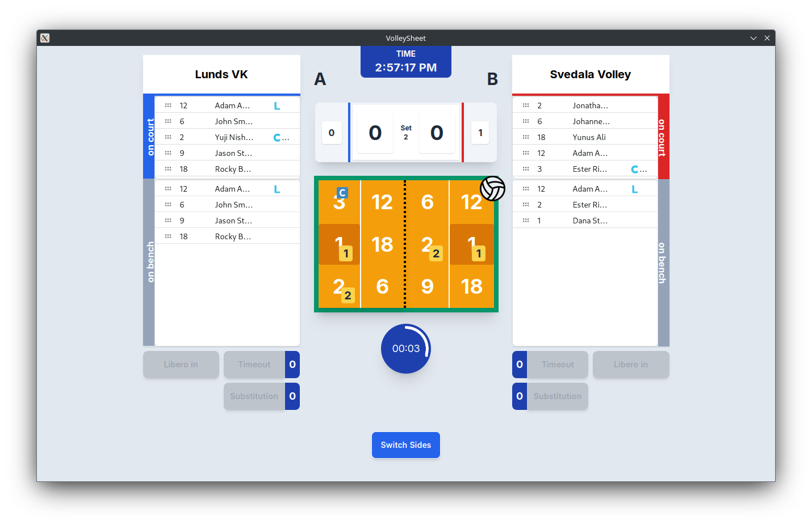

# 🏐 VolleySheet (Under Development)

Free Volleyball Scoresheet Compiler

## Overview

- Manage teams, rosters and line-ups
- Keeps track of rotations during match
- Enforces rules for substitutions, liberos and time outs
- Export match reports



## Installation

### Binary 

Packages for Windows, Linux & MacOS under Releases

### Manual

Built using [Wails](https://wails.io/).

```bash
go install github.com/wailsapp/wails/v2/cmd/wails@latest # Requires Go 1.18+
cd volleysheet && wails build # Find binary under /build
```


